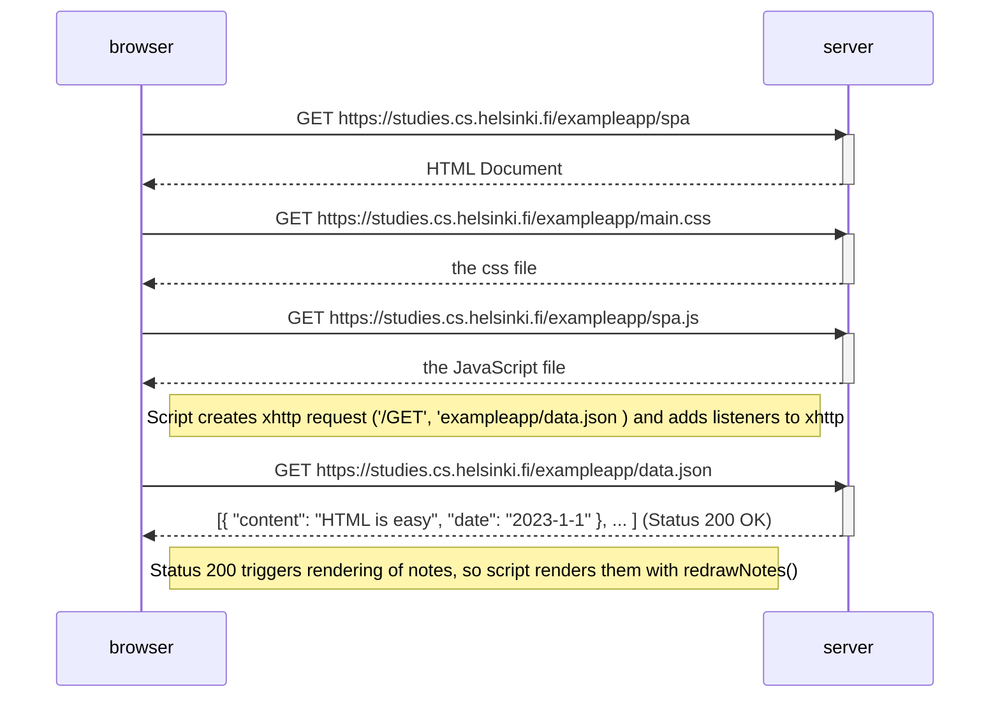

```mermaid
sequenceDiagram
    participant browser
    participant server

    browser->>server: GET https://studies.cs.helsinki.fi/exampleapp/spa
    activate server
    server-->>browser: HTML Document 
    deactivate server

   
    browser->>server: GET https://studies.cs.helsinki.fi/exampleapp/main.css
    activate server
    server-->>browser: the css file
    deactivate server

    browser->>server: GET https://studies.cs.helsinki.fi/exampleapp/spa.js
    activate server
    server-->>browser: the JavaScript file 
    deactivate server

    Note right of browser: Script creates xhttp request ('/GET', 'exampleapp/data.json ) and adds listeners to xhttp  

    browser->>server: GET https://studies.cs.helsinki.fi/exampleapp/data.json
    activate server
    server-->>browser: [{ "content": "HTML is easy", "date": "2023-1-1" }, ... ] (Status 200 OK)
    deactivate server

    Note right of browser:  Status 200 triggers rendering of notes, so script renders them with redrawNotes()
    

```
