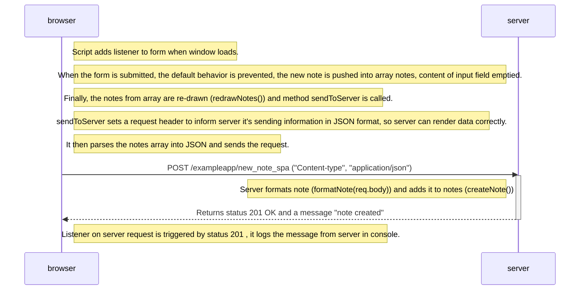

```mermaid
sequenceDiagram
    participant browser
    participant server

    Note right of browser: Script adds listener to form when window loads. 

    Note right of browser: When the form is submitted, the default behavior is prevented, the new note is pushed into array notes, content of input field emptied.

    Note right of browser:Finally, the notes from array are re-drawn (redrawNotes()) and method sendToServer is called.

    Note right of browser: sendToServer sets a request header to inform server it's sending information in JSON format, so server can render data correctly.

    Note right of browser:It then parses the notes array into JSON and sends the request.

    browser->>server: POST /exampleapp/new_note_spa ("Content-type", "application/json")
    activate server

    Note left of server: Server formats note (formatNote(req.body)) and adds it to notes (createNote())
    server-->>browser: Returns status 201 OK and a message "note created"  
    deactivate server

    Note right of browser: Listener on server request is triggered by status 201 , it logs the message from server in console.
   
  
    

```
